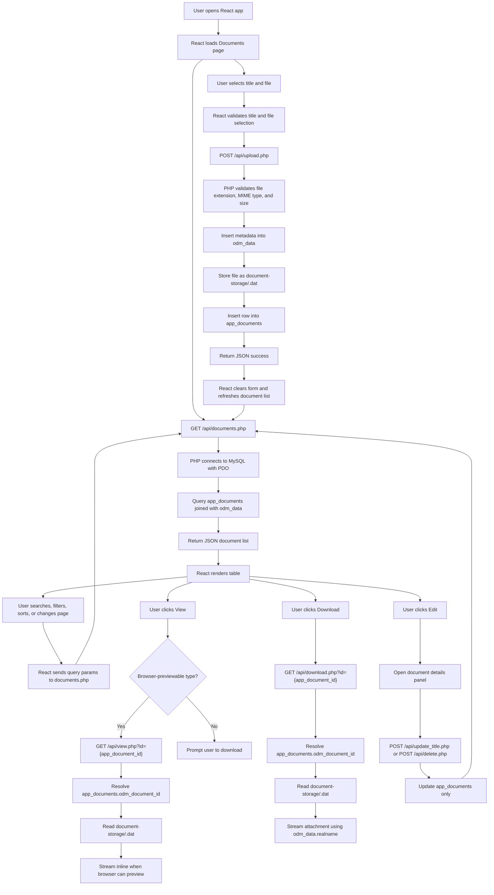

# Document Repository Application Documentation

## Overview

This application is a lightweight document repository frontend built on top of an existing OpenDocMan installation.

OpenDocMan remains the storage backend. Users interact only with the custom React interface and PHP APIs.

Architecture:

```text
React + Vite frontend
        |
        v
PHP API layer
        |
        v
MySQL database
        |
        v
OpenDocMan metadata + document-storage files
```

Custom code lives in:

- `frontend/`
- `backend/`

OpenDocMan source lives in:

- `opendocman/`

OpenDocMan source should not be modified for this custom UI.

## Current Features

### Upload Documents

Users can upload supported document/image files from the custom UI.

Upload form fields:

- Title
- File picker
- Drag-and-drop file area

Current upload behavior:

- Validates title before upload.
- Validates that a file is selected.
- Shows user-friendly validation errors.
- Upload button is disabled until a file is selected.
- Shows upload progress while the browser sends the file.
- Shows selected file as a compact attachment chip.
- Allows removing the selected file before upload.
- Warns when the selected original filename already exists.
- Clears title and file fields after successful upload.
- Refreshes the document list automatically after upload.
- Does not reload the page.

### List Documents

The Documents card displays uploaded documents in a table.

Columns:

- Title
- File type
- Original filename
- Upload date
- Actions

Table behavior:

- Uses fixed layout.
- Fits within the page without horizontal scrolling.
- Long title and filename values truncate with ellipsis.
- Full title and filename are available through hover tooltips.
- Upload date is formatted without seconds.
- Search, date filter, sort, and pagination are handled server-side by `documents.php`.
- The frontend requests 10 documents per page by default.

### View And Download

Each row provides icon-only action buttons:

- Edit: opens an inline document details panel.
- View: opens supported files in the browser where possible.
- Unsupported browser preview types prompt the user to download instead.
- Download: downloads the original file using the original filename.

### Search, Filter, And Pagination

The Documents section includes server-side controls:

- Search by title or original filename.
- Filter by upload date.
- Sort by title, type, original filename, or upload date.
- Paginate documents 10 at a time.
- Previous and Next navigation.
- Showing count, such as `Showing 1-10 of 25`.

The frontend sends these controls to `GET /api/documents.php`, and the backend returns the current page plus pagination metadata.

### Edit And Soft Delete

The document details panel supports:

- Viewing type, upload date, app document ID, and OpenDocMan ID.
- Editing the custom title stored in `app_documents.title`.
- Removing a document from the custom UI with a soft delete.

Soft delete behavior:

- Sets `app_documents.deleted_at`.
- Hides the row from list/view/download APIs.
- Does not delete the OpenDocMan `odm_data` row.
- Does not delete the physical `<odm_data.id>.dat` file.

### Health Check

The app includes a health API and simple health page.

Health page:

```text
/health
```

Health API:

```text
GET /api/health.php
```

Checks:

- API reachability.
- Database connectivity.
- Storage directory readability/writability.

## Frontend Structure

Main files:

- `frontend/src/App.jsx`
- `frontend/src/components/UploadForm.jsx`
- `frontend/src/api.js`
- `frontend/src/App.css`
- `frontend/src/index.css`

Responsibilities:

- `App.jsx`: page layout, document fetching, table display, search/filter/pagination.
- `UploadForm.jsx`: upload form state, file picker UI, validation, upload submission.
- `api.js`: frontend API helpers.
- `App.css`: application styling.
- `index.css`: global base styles.

Frontend rules:

- React functional components only.
- Hooks only.
- Plain CSS only.
- No UI framework.
- No global state library.

## Backend Structure

Main files:

- `backend/api/upload.php`
- `backend/api/documents.php`
- `backend/api/view.php`
- `backend/api/download.php`
- `backend/api/helpers.php`
- `backend/config/database.php`
- `backend/config/app.php`

Backend rules:

- PHP APIs.
- PDO database access.
- Prepared statements.
- JSON responses for API operations.
- File stream responses for successful view/download operations.
- No PHP framework.
- No ORM.

## APIs Added

### `POST /api/upload.php`

Uploads a document.

Input:

- `title`
- `file`

Behavior:

- Validates title.
- Validates file size, extension, and MIME type.
- Inserts metadata into `odm_data`.
- Stores file as `<odm_data.id>.dat` in `document-storage`.
- Inserts custom record into `app_documents`.
- Returns JSON.

Successful response:

```json
{
  "success": true,
  "message": "Document uploaded successfully.",
  "document": {
    "id": 1,
    "title": "Example",
    "original_filename": "example.pdf"
  }
}
```

### `GET /api/documents.php`

Lists documents.

Behavior:

- Reads from `app_documents`.
- Joins to `odm_data`.
- Applies server-side search, date filtering, sorting, and pagination.
- Returns document title, OpenDocMan ID, original filename, upload date, action URLs, and pagination metadata.

Query parameters:

- `page`
- `page_size`
- `search`
- `date`
- `sort`
- `direction`

Successful response:

```json
{
  "success": true,
  "documents": [
    {
      "id": 1,
      "title": "Example",
      "original_filename": "example.pdf",
      "upload_date": "2026-06-04 23:23:00",
      "view_url": "/api/view.php?id=1",
      "download_url": "/api/download.php?id=1"
    }
  ],
  "pagination": {
    "page": 1,
    "page_size": 10,
    "total": 25,
    "total_pages": 3,
    "sort": "upload_date",
    "direction": "desc",
    "search": "",
    "date": ""
  }
}
```

### `GET /api/view.php?id={id}`

Views a document.

Behavior:

- Resolves custom app document ID.
- Finds linked OpenDocMan document ID.
- Loads `document-storage/<odm_data.id>.dat`.
- Streams supported browser-viewable files inline.
- Falls back to attachment behavior for files that browsers usually cannot preview.

### `GET /api/download.php?id={id}`

Downloads a document.

Behavior:

- Resolves custom app document ID.
- Finds linked OpenDocMan document ID.
- Loads `document-storage/<odm_data.id>.dat`.
- Streams file as an attachment using `odm_data.realname`.

### `POST /api/update_title.php`

Updates the custom app document title.

Input:

```json
{
  "id": 1,
  "title": "Updated title"
}
```

Behavior:

- Validates document ID.
- Validates non-empty title.
- Updates `app_documents.title`.
- Does not change `odm_data.realname` or the physical stored file.

### `POST /api/delete.php`

Soft deletes a custom app document row.

Input:

```json
{
  "id": 1
}
```

Behavior:

- Sets `app_documents.deleted_at`.
- Hides the document from custom app list/view/download behavior.
- Leaves OpenDocMan metadata and storage intact.

### `GET /api/health.php`

Returns application health status.

Behavior:

- Confirms API reachability.
- Checks database connectivity.
- Checks storage directory readability/writability.

Successful response:

```json
{
  "success": true,
  "status": "ok",
  "checks": {
    "api": {
      "ok": true,
      "message": "API is reachable."
    },
    "database": {
      "ok": true,
      "message": "Database connection is working."
    },
    "storage": {
      "ok": true,
      "message": "Storage directory is readable and writable."
    }
  }
}
```

## Database Tables

### `app_documents`

Custom application table.

Important columns:

- `id`
- `title`
- `odm_document_id`
- `created_at`
- `deleted_at`

Relationship:

```text
app_documents.odm_document_id -> odm_data.id
```

### `odm_data`

OpenDocMan metadata table.

Important columns:

- `id`
- `realname`
- `description`
- `created`
- `owner`
- `category`
- `department`
- `publishable`

Original filename is stored in:

```text
odm_data.realname
```

Physical files are stored as:

```text
document-storage/<odm_data.id>.dat
```

Example:

```text
odm_data.id = 42
document-storage/42.dat
```

## Application Flowchart



## Data Flow

### Document List Flow

```text
React App
  -> GET /api/documents.php?page=1&page_size=10&search=&date=&sort=upload_date&direction=desc
  -> PHP validates query parameters
  -> PHP PDO prepared statements
  -> app_documents + odm_data
  -> JSON response with documents + pagination metadata
  -> React table
```

### Upload Flow

```text
User selects title and file
  -> React validates required fields
  -> POST multipart form data to upload.php
  -> PHP validates file
  -> Insert into odm_data
  -> Move uploaded file to document-storage/<odm_data.id>.dat
  -> Insert into app_documents
  -> Return JSON success
  -> React resets form
  -> React refreshes document list
```

### View Flow

```text
User clicks View
  -> React checks browser-previewable extension
  -> If not previewable, prompt to download
  -> GET /api/view.php?id={app_documents.id}
  -> PHP resolves app_documents.odm_document_id
  -> PHP loads document-storage/<odm_document_id>.dat
  -> PHP streams file with inline or attachment disposition
```

### Edit Title Flow

```text
User clicks Edit
  -> React opens details panel
  -> User edits title
  -> POST /api/update_title.php
  -> PHP validates id and title
  -> PHP updates app_documents.title
  -> React refreshes current document page
```

### Soft Delete Flow

```text
User clicks Remove from list
  -> React confirms action
  -> POST /api/delete.php
  -> PHP sets app_documents.deleted_at
  -> List/view/download APIs hide the deleted row
  -> OpenDocMan metadata and physical storage remain untouched
```

### Health Flow

```text
User opens /health
  -> React calls GET /api/health.php
  -> PHP checks API, database, and storage
  -> React displays healthy/degraded checks
```

### Download Flow

```text
User clicks Download
  -> GET /api/download.php?id={app_documents.id}
  -> PHP resolves app_documents.odm_document_id
  -> PHP loads document-storage/<odm_document_id>.dat
  -> PHP streams file as attachment
  -> Browser downloads using odm_data.realname
```

## Security Notes

Current implemented safeguards:

- PDO prepared statements.
- No raw file paths accepted from the frontend.
- Document IDs are validated as integers.
- File extension allowlist.
- MIME type allowlist.
- Maximum upload size.
- Stored files use OpenDocMan naming convention.
- API errors avoid exposing SQL details to users.

Current intentionally omitted features:

- Authentication.
- Authorization UI.
- Role management.
- OpenDocMan workflow approvals.
- Dashboards.
- Analytics.
- Notifications.
- Versioning.

## Practical Improvements To Consider

### 1. Better Operational Logging

Add a small custom audit table for actions taken through the custom UI:

- Upload.
- Edit title.
- Soft delete.
- View.
- Download.

This should be separate from OpenDocMan unless there is a clear reason to integrate.

### 2. Production Deployment Hardening

Before production use:

- Restrict CORS to the deployed frontend origin.
- Serve PHP APIs behind HTTPS.
- Ensure `document-storage` is outside the public web root.
- Configure PHP upload limits to match the app limit.
- Add server-level file execution protections for storage directories.

### 3. Restore Soft-Deleted Records

If users need recovery, add a simple admin-only restoration workflow later.

Keep it separate from OpenDocMan workflow approvals unless explicit integration is required.

### 4. Larger Dataset Indexes

For larger installations, add indexes around:

- `app_documents.deleted_at`
- `app_documents.created_at`
- `app_documents.title`
- `app_documents.odm_document_id`
- `odm_data.realname`

## New Machine Setup Scripts

Before running setup, read:

```text
install.txt
```

It lists required software, install commands, setup commands, and common error fixes.

### macOS/Linux

```sh
./setup-new-machine.sh
```

This script creates a fresh database from `database_schema.sql`. It does not import `opendocman_backup.sql` and does not carry document data from this machine.

### Windows

Use PowerShell from `document-management/`:

```powershell
Set-ExecutionPolicy -Scope Process -ExecutionPolicy Bypass
.\setup-windows.ps1
```

To explicitly request Administrator relaunch if needed:

```powershell
.\setup-windows.ps1 -RequireAdmin
```

The Windows script also creates a fresh database from `database_schema.sql`. It does not import `opendocman_backup.sql` and does not carry document data from this machine.

The setup scripts:

- Checks PHP, Node.js, npm, and MySQL.
- Creates/verifies the document storage directory.
- Verifies the MySQL connection.
- Creates or prepares the database.
- Optionally updates OpenDocMan `odm_settings.dataDir`.
- Installs frontend dependencies.
- Builds the frontend.
- Prints the backend and frontend run commands.

Run help for all options:

```sh
./setup-new-machine.sh --help
```

## Local Development

Start the backend from `document-management/`:

```sh
php -S localhost:8000 -t backend
```

Start the frontend from `document-management/frontend/`:

```sh
npm run dev
```

Frontend URL:

```text
http://127.0.0.1:5173/
```

Backend URL:

```text
http://localhost:8000/
```

Vite proxies `/api` requests to the PHP backend during local development.
