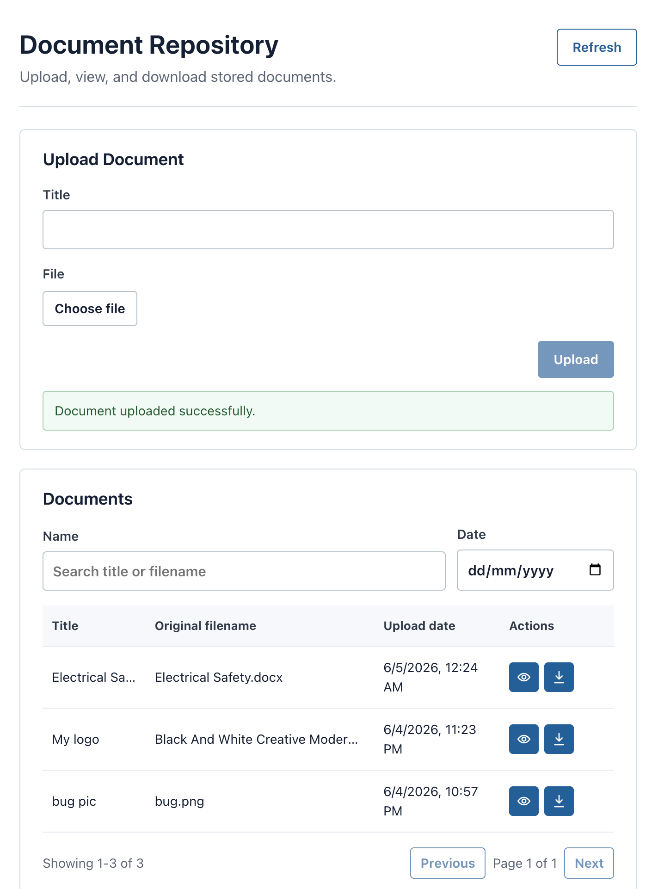
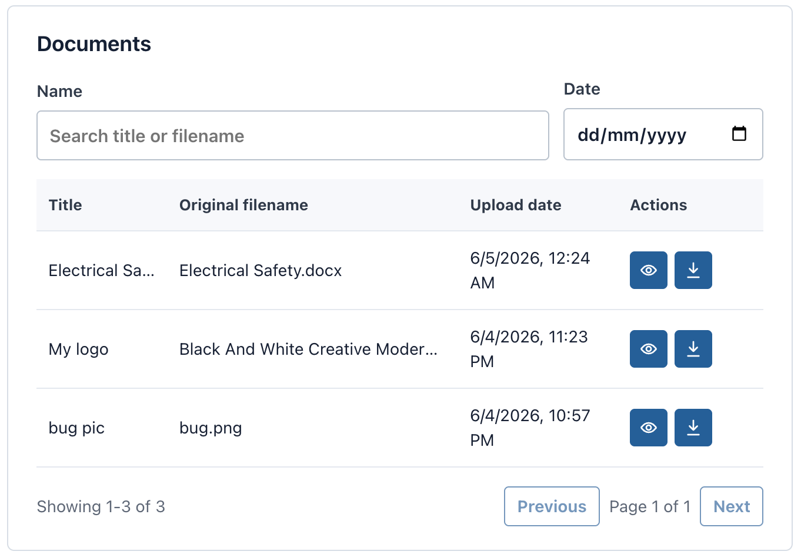
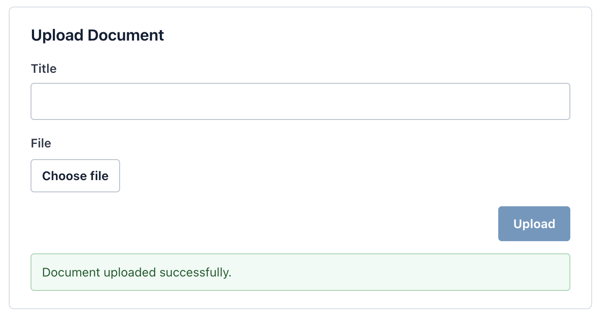

# Document Repository

A lightweight document management system built with React, Vite, PHP, MySQL, and OpenDocMan.

This project provides a modern document repository interface while using OpenDocMan as the underlying storage and metadata engine.

The OpenDocMan UI is not used. All user interactions happen through a custom React frontend and PHP API layer.

---

## Features

* Upload documents
* Drag-and-drop upload
* Upload progress
* Duplicate filename warning
* Store files using OpenDocMan storage conventions
* View supported files directly in the browser
* Prompt to download files that browsers usually cannot preview
* Download files using original filenames
* Maintain document metadata
* Server-side search, date filtering, sorting, and pagination
* Edit custom document titles
* Soft delete custom app records without deleting OpenDocMan files
* Health check API and `/health` page
* Responsive modern UI
* Lightweight PHP backend
* MySQL persistence
* OpenDocMan-backed storage

---

## Technology Stack

### Frontend

* React
* Vite
* JavaScript
* CSS

### Backend

* PHP 8+
* PDO

### Database

* MySQL

### Storage Engine

* OpenDocMan

---

## Architecture

```text
React Frontend
        │
        ▼
PHP API Layer
        │
        ▼
MySQL Database
        │
        ▼
OpenDocMan Metadata + File Storage
```

OpenDocMan is used only for document storage and metadata persistence.

The OpenDocMan web interface is not part of this application.

---

## Repository Structure

```text
Projects/
├── opendocman frontend/
│   ├── frontend/
│   ├── backend/
│   ├── opendocman/
│   ├── AGENTS.md
│   ├── CONTEXT.md
│   ├── PRD.md
│   ├── database_schema.sql
│   └── README.md
│
└── document-storage/
```

---

## OpenDocMan Integration

### Metadata Storage

Document metadata is stored in:

```sql
odm_data
```

Important fields:

```sql
id
realname
description
created
owner
category
status
publishable
```

### Physical File Storage

Files are stored using OpenDocMan conventions:

```text
<odm_data.id>.dat
```

Examples:

```text
1.dat
2.dat
42.dat
```

Original filename:

```text
odm_data.realname
```

---

## Storage Directory

Uploaded files are stored outside the repository.

Example:

```text
/Users/debarshi/Projects/document-storage
```

The storage location is configured through backend and OpenDocMan configuration.

---

## Upload Flow

1. User enters title and selects a file.
2. Frontend submits the upload request.
3. Backend validates:

   * File size
   * MIME type
   * Extension
4. Metadata is inserted into `odm_data`.
5. Generated `odm_data.id` is retrieved.
6. File is stored as:

```text
<odm_data.id>.dat
```

7. A reference record is inserted into:

```sql
app_documents
```

8. Frontend refreshes automatically.

---

## Document Listing

Displayed fields:

* Title
* File Type
* Original Filename
* Upload Date

Available actions:

* Edit title
* View
* Download

List controls:

* Server-side search by title or original filename
* Date filter
* Sort by title, type, original filename, and upload date
* Pagination, 10 files per page by default

---

## Health Check

The app includes:

```text
GET /api/health.php
```

Frontend health page:

```text
http://127.0.0.1:5173/health
```

It checks:

* API reachability
* Database connectivity
* Storage directory readability/writability

---

## Production Configuration

Copy the example config:

```bash
cp backend/config/production.example.php backend/config/production.php
```

Then edit `backend/config/production.php` for the target machine database credentials and storage path.

`backend/config/production.php` is ignored by git. Environment variables still take precedence.

---

## Security

Allowed file types:

```text
pdf
doc
docx
xls
xlsx
ppt
pptx
jpg
jpeg
png
```

Maximum file size:

```text
20 MB
```

Validation includes:

* MIME type validation
* Extension validation
* File size validation

Protection against:

* SQL Injection
* Path Traversal
* Arbitrary File Execution

All database operations use PDO prepared statements.

---

## Local Development

### Frontend

```bash
cd frontend
npm install
npm run dev
```

Default URL:

```text
http://127.0.0.1:5173
```

### Backend

```bash
php -S localhost:8000 -t backend
```

The Vite dev server proxies `/api` requests to `http://localhost:8000`.

---

## Database

Schema reference:

```text
database_schema.sql
```

This file is the source of truth for the database structure.

---

## Screenshots

### Upload Page



### Documents List



### Upload Success



---

## Development Guidelines

* Do not modify OpenDocMan source code.
* Keep all custom code separate from OpenDocMan.
* Use React functional components.
* Use plain CSS.
* Use PDO prepared statements.
* Return JSON from APIs.
* Avoid unnecessary dependencies.

---

## AI Agent Instructions

Before implementation, AI agents must read:

```text
AGENTS.md
CONTEXT.md
PRD.md
database_schema.sql
```

These files are authoritative.

---

## License

This project integrates OpenDocMan.

OpenDocMan is licensed under the GNU General Public License (GPL).

If OpenDocMan source code is redistributed with this repository, all applicable GPL requirements must be followed.

Refer to the license files contained within the `opendocman/` directory.
